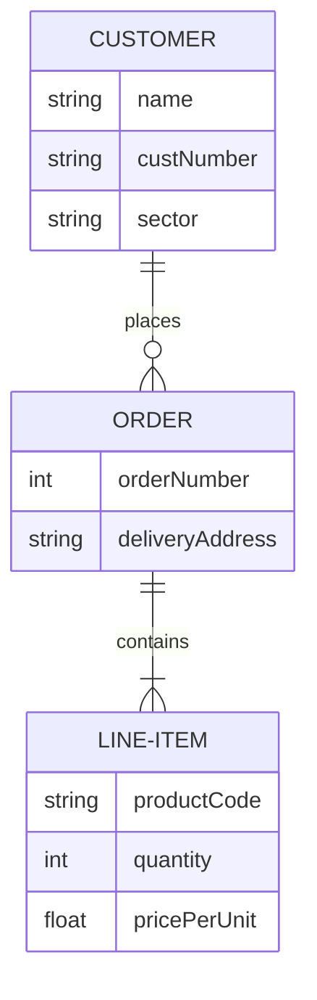

# Project Docs

We can use this to document our solution. The documentation is versioned along with the source code.

## Features

### Code

=== "Input"

    ````text
    ```python
    def foo():
        print("Hello World")
    ```
    ````

=== "Output"

    ```python
    def foo():
        print("Hello World")
    ```

### Code Tabs

=== "Input"

    ````text
    === "C"

        ``` c
        #include <stdio.h>

        int main(void) {
          printf("Hello world!\n");
          return 0;
        }
        ```

    === "C++"

        ``` c++
        #include <iostream>

        int main(void) {
          std::cout << "Hello world!" << std::endl;
          return 0;
        }
        ```
    ````

=== "Output"

    === "C"

        ``` c
        #include <stdio.h>

        int main(void) {
          printf("Hello world!\n");
          return 0;
        }
        ```

    === "C++"

        ``` c++
        #include <iostream>

        int main(void) {
          std::cout << "Hello world!" << std::endl;
          return 0;
        }
        ```

### Graphs with [Mermaid](https://mermaid-js.github.io/mermaid/#/)

**Input**

````text

````

**Output**


### Other Features

See [here](https://squidfunk.github.io/mkdocs-material/reference/abbreviations/) for other Material for MkDocs features.